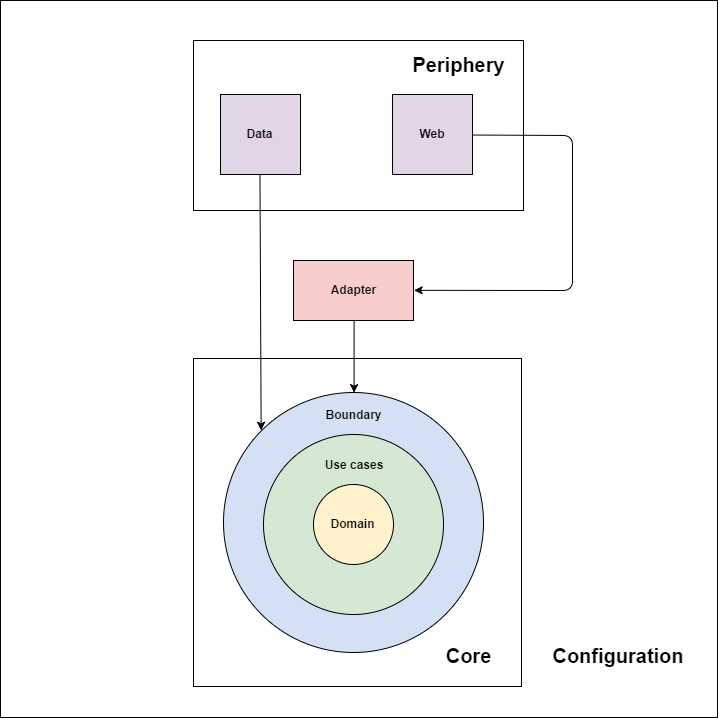

# Clean architecture example

The basic purpose of clean architecture is to make clear the intention of what the application does and how it does it.

That is why these two things need to be separated.

## The what
| Package     | Intent |
| --------|---------|
| core  | Should only need to look inside this package to know what the system does. Has no dependencies to any framework (e.g. Spring, hibernate, play, drop wizard…) |
| core > domain | Entities and value objects |
| core > usecase | The use cases (or application services) |
| core > boundary | The only way into and out of the core. Contains only interfaces. |
| core > boundary > enter | Interfaces that the core > usecase implements. These are used in the adapter (can also be used in the periphery). |
| core > boundary > exit | Interfaces used by the core > usecase. These are implemented in the periphery (e.g. repositories). |
                    
## The how
| Module     | Intent |
| --------|---------|
| adapter  | Converts the domain objects returned by the uses cases into the appropriate format (e.g. DTO’s) for use in the periphery |
| periphery | Anything framework related (e.g. repositories, controllers) |
| configuration | How the application is glued together (e.g. spring @Configuration classes) |

## Building and running the app

### Enable Annotation Processing
**Note:** This example app uses [Immutables](http://immutables.github.io/), hence the need to enable annotation processing

In IntelliJ: 
  1. **File > Settings > Build > Compiler > Annotation Processors**
  2. Tick **Enable Annotation Processing** and select **Module content root**
  3. Build the project via **Build > Build Project**
  4. In **application > core** module right click on  **generated** folder and **Mark directory as > Generated Sources Root**

### Run the application
On the command line in the clean-architecture-example folder type **gradlew bootRun**

**Application URL:** http://localhost:13001